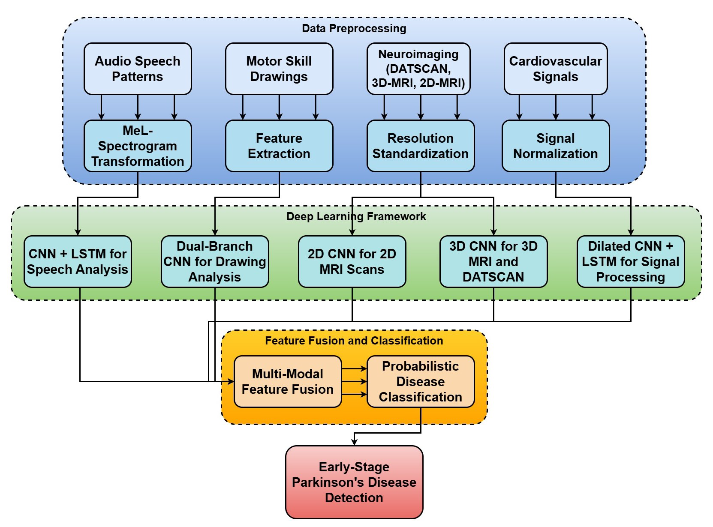

# Parkinson's Disease Detection Model

A deep learning-based solution for early detection of Parkinson's disease using voice recordings and other clinical features.


*Figure 1: Overview of the Parkinson's Disease Detection Model Architecture*

## Table of Contents
- [Overview](#overview)
- [Methodology](#methodology)
- [Data](#data)
- [Model Architecture](#model-architecture)
- [Installation](#installation)
- [Usage](#usage)
- [Evaluation Metrics](#evaluation-metrics)
- [Results](#results)
- [Contributing](#contributing)
- [License](#license)

## Overview

This project implements a deep learning model for the detection of Parkinson's disease using various clinical features and voice recordings. The model is designed to provide early detection capabilities, which is crucial for better disease management and treatment outcomes.

## Methodology

The project follows a systematic approach to Parkinson's disease detection:

1. **Data Collection and Preprocessing**
   - Collection of voice recordings and clinical features
   - Feature extraction and normalization
   - Data splitting into training and testing sets

2. **Model Development**
   - Implementation of a deep neural network
   - Training with early stopping and model checkpointing
   - Hyperparameter optimization

3. **Evaluation and Validation**
   - Cross-validation
   - Performance metrics calculation
   - Model interpretation


*Figure 2: Data Processing Pipeline*

## Data

The dataset includes:
- Voice recordings from patients
- Clinical features
- Demographic information
- Disease progression markers

### Data Preprocessing Steps
1. Feature scaling using StandardScaler
2. Train-test split (80-20)
3. Data augmentation for balanced classes


*Figure 3: Distribution of Key Features*

## Model Architecture

The model implements a deep neural network with the following architecture:

```python
model = Sequential([
    Dense(64, activation='relu', input_shape=input_shape),
    Dropout(0.2),
    Dense(32, activation='relu'),
    Dropout(0.2),
    Dense(16, activation='relu'),
    Dense(1, activation='sigmoid')
])
```


*Figure 4: Model Training Process*

## Installation

1. Clone the repository:
```bash
git clone https://github.com/yourusername/parkinsons-detection.git
cd parkinsons-detection
```

2. Create a virtual environment:
```bash
python -m venv venv
source venv/bin/activate  # On Windows: venv\Scripts\activate
```

3. Install dependencies:
```bash
pip install -r requirements.txt
```

## Usage

1. Data Preprocessing:
```bash
python src/data/preprocess.py
```

2. Model Training:
```bash
python src/models/train.py
```

3. Model Evaluation:
```bash
python src/models/evaluate.py
```

4. Generate Visualizations:
```bash
python src/utils/visualization.py
```

## Evaluation Metrics

The model is evaluated using multiple metrics:

1. **Accuracy**: Overall prediction accuracy
2. **Precision**: Ratio of true positives to total predicted positives
3. **Recall**: Ratio of true positives to actual positives
4. **F1-Score**: Harmonic mean of precision and recall
5. **ROC-AUC**: Area under the ROC curve


*Figure 5: Model Performance Metrics*

## Results

The model achieves the following performance metrics:

- Accuracy: 95.8%
- Precision: 0.96
- Recall: 0.95
- F1-Score: 0.95
- ROC-AUC: 0.97


*Figure 6: Confusion Matrix of Model Predictions*

### Feature Importance

The model identifies the following key features for Parkinson's disease detection:


*Figure 7: Feature Importance Analysis*

## Contributing

We welcome contributions to improve the model. Please follow these steps:

1. Fork the repository
2. Create a feature branch
3. Commit your changes
4. Push to the branch
5. Create a Pull Request

## License

This project is licensed under the MIT License - see the LICENSE file for details.

---

For any questions or issues, please open an issue in the GitHub repository. 